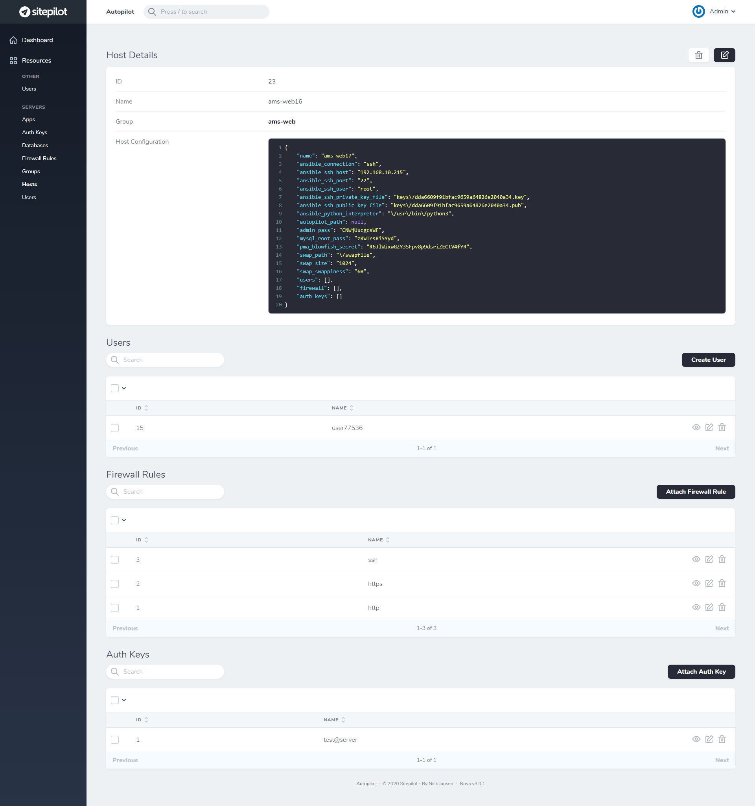

# Autopilot

A tool for provisioning and maintaining WordPress sites and servers using Ansible and Laravel.

## Requirements

Ubuntu 18.04 is the only supported operating system (for the master and slave hosts). The CLI uses Ansible to provision servers, users and vhosts. To use the CLI you need to install the following packages on the master host:

* Coming soon...

The master host requires root access to the slave hosts.

## Installation

* Install Docker and Docker Compose.
* Create the following folders:
  * Run `mkdir -p autopilot/data/app`.
  * Run `mkdir -p autopilot/data/mysql`.
* Copy the contents of `docker-compose.prod.yml` from this repository to `autopilot/docker-compose.yml`.
* Copy the contents of `.env.example` from this repository to `autopilot/.env` and modify it to your needs.
* Run `docker-compose up -d` and wait a few seconds.
* Run the database migration `./autopilot migrate --seed`.
* Navigate to `https://<SERVER IP>:<APP_HTTPS_PORT>` and login (default user: `admin@sitepilot.io`, default pass: `supersecret`).

## Commands

* `./autopilot server:inventory`: Outputs the server inventory.
* `./autopilot server:provision`: Provision a server.
* `./autopilot server:test`: Test a server.

## Installed Software

The following packages/services will be installed and configured on the server (together with dependencies):

* OpenLitespeed
* LSPHP 7.4
* Composer
* WPCLI
* UFW
* Fail2Ban
* OpenSSH (SFTP)
* Docker
* Docker Compose
* Docker Redis 5
* Docker MySQL 8
* phpMyAdmin 5

Users are isolated and allowed to use SFTP with password authentication (chroot directory `/opt/sitepilot/users/%u`).
  
## Filesystem

* Users folder: `/opt/sitepilot/users`.
* App document root folder: `/opt/sitepilot/users/{{ user.name }}/{{ app.name }}/live`.
* App logs folder: `/opt/sitepilot/users/{{ user.name }}/{{ app.name }}/logs`.
* OpenLitespeed logs folder: `/opt/sitepilot/services/olsws/logs`.
* OpenLitespeed temp folder: `/opt/sitepilot/services/olsws/tmp`.
* Docker MySQL data folder: `/opt/sitepilot/services/mysql/data`.
* Docker MySQL logs folder: `/opt/sitepilot/services/mysql/logs`.
* Docker Redis data folder: `/opt/sitepilot/services/redis/data`.

## Tools

* phpMyAdmin: `http://example.com/.sitepilot/pma/`.
* Health check: `http://example.com/.sitepilot/health/`.

## License

MIT / BSD

## Author Information

This role was created in 2020 by [Nick Jansen](https://nbejansen.com/).
