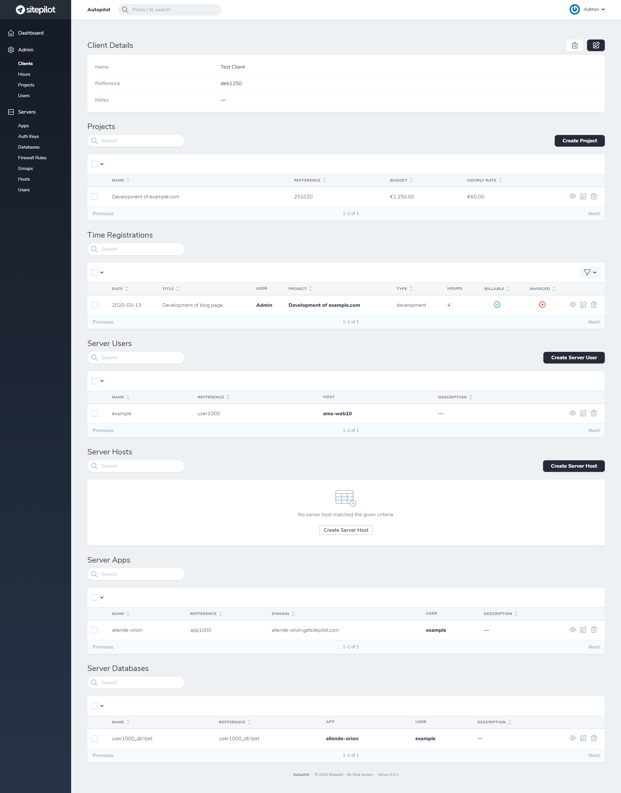

# Autopilot

A tool for provisioning and maintaining WordPress sites and servers using Ansible and Laravel.

## Requirements

Ubuntu 18.04 is the only supported operating system (for the master and slave hosts). Autopilot uses Ansible to provision servers, users and vhosts. To use Autopilot you need to install the following packages on the master host:

* A [Laravel Nova](https://nova.laravel.com/) license.
* [Docker](https://www.docker.com/) and [Docker Compose](https://docs.docker.com/compose/install/).

*NOTE: The master host requires root access to the slave hosts.*

## Installation

* Create a directory: `mkdir ~/autopilot && cd ~/autopilot`.
* Download Autopilot script: `curl -o ./autopilot https://raw.githubusercontent.com/sitepilot/autopilot/autopilot && chmod +x ~/autopilot`.
* Download environment file and modify it to your needs: `curl -o ./.env https://raw.githubusercontent.com/sitepilot/autopilot/.env.example && nano ./.env`.
* Run `./autopilot install` to start the containers, install packages and migrate the database. *NOTE: This will prompt for your Laravel Nova username and password.*
* Navigate to `https://<SERVER IP>:<APP_HTTPS_PORT>` and login (default user: `admin@sitepilot.io`, default pass: `supersecret`).

## Update

* Navigate to the Autopilot installation folder: `cd ~/autopilot`.
* Update Autopilot script: `curl -o ~/autopilot https://raw.githubusercontent.com/sitepilot/autopilot/autopilot && chmod +x ~/autopilot`.
* Run `./autopilot update` to update the containers, packages and migrate the database.

## Commands

* `./autopilot server:inventory`: Outputs the inventory in JSON format.
* `./autopilot server:provision`: Provision a server.
* `./autopilot server:test`: Test a server.

## Server Configuration

### Packages & Services

The following packages/services will be installed and configured on servers (together with dependencies):

* OpenLitespeed
* LSPHP 7.4
* Composer
* WPCLI
* UFW
* Fail2Ban
* OpenSSH (SFTP)
* Docker
* Docker Compose
* Docker Redis 5
* Docker MySQL 8
* phpMyAdmin 5

Users are isolated and allowed to use SFTP with password authentication (chroot directory `/opt/sitepilot/users/%u`).

### Tools

* phpMyAdmin: `http://example.com/.sitepilot/pma/`.
* Health check: `http://example.com/.sitepilot/health/`.

### Filesystem

* Users folder: `/opt/sitepilot/users`.
* App document root folder: `/opt/sitepilot/users/{{ user.name }}/{{ app.name }}/live`.
* App logs folder: `/opt/sitepilot/users/{{ user.name }}/{{ app.name }}/logs`.
* OpenLitespeed logs folder: `/opt/sitepilot/services/olsws/logs`.
* OpenLitespeed temp folder: `/opt/sitepilot/services/olsws/tmp`.
* Docker MySQL data folder: `/opt/sitepilot/services/mysql/data`.
* Docker MySQL logs folder: `/opt/sitepilot/services/mysql/logs`.
* Docker Redis data folder: `/opt/sitepilot/services/redis/data`.

## License

MIT / BSD

## Author

Autopilot was created in 2020 by [Nick Jansen](https://nbejansen.com/).
